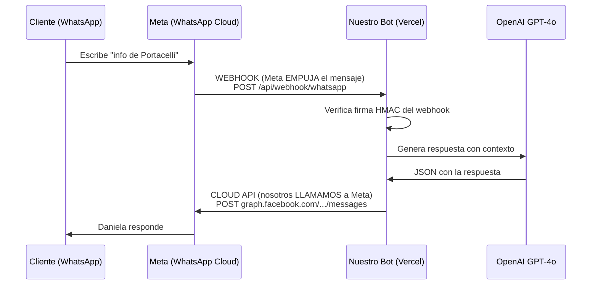

# Daniela — Arquitectura, Configuración y Replicación

Guía técnica completa del bot SDR de WhatsApp de Grupo Terranova. Cubre cómo está construido, qué usa por fuera, cómo conectamos Meta, y cómo replicarlo desde cero. Documento vivo — última actualización: 7 julio 2026.

---

## 1. Qué es

Daniela es una **SDR (vendedora) autónoma que atiende WhatsApp**. Recibe mensajes de clientes interesados en propiedades, responde con contexto real del catálogo, califica al lead, agenda citas, escala al CEO cuando toca y da seguimiento. Corre 24/7 sin intervención humana, con un panel CRM para que el equipo tome el control cuando quiera.

No es un árbol de botones: cada respuesta la genera un modelo de IA (GPT-4o) con el conocimiento completo del negocio inyectado en tiempo real.

---

## 2. Stack tecnológico

| Capa | Tecnología | Versión | Rol |
|------|-----------|---------|-----|
| Framework | **Next.js** (App Router) | 16.2.6 | API routes (webhook, crons) + panel web en un solo repo |
| Runtime | **React** | 19.2.4 | UI del panel |
| Hosting | **Vercel** | — | Serverless functions + cron jobs + deploy por git push |
| Base de datos | **Supabase** (PostgreSQL) | SDK 2.106 | Datos, autenticación del panel, RLS |
| IA (cerebro) | **OpenAI GPT-4o** | SDK 6.39 | Genera cada respuesta en JSON estructurado |
| IA (voz) | **OpenAI Whisper** | — | Transcribe notas de voz a texto |
| Mensajería | **WhatsApp Cloud API** (Meta) | Graph v23.0 | Recibir (webhook) y enviar mensajes |
| Calendario | **Google Calendar API** | googleapis 173 | Agenda citas automáticas |
| Estilos | **Tailwind CSS** | 4 | UI |
| Lenguaje | **TypeScript** | 5 | Todo el código |
| Tests | **Vitest** | 4.1.7 | 275+ tests unitarios |

> **Nota de nombres:** la carpeta `services/claude/` se llama así por legado, pero **usa OpenAI GPT-4o**, no Claude. El modelo está fijado en `services/claude/client.ts` (`MODEL = 'gpt-4o'`). Es solo el nombre de la carpeta.

---

## 3. Servicios externos (todo lo que vive fuera del repo)

| Servicio | Host | Para qué lo usamos | Variables |
|----------|------|--------------------|-----------|
| **Meta WhatsApp** | `graph.facebook.com` | Recibir y enviar mensajes de WhatsApp | `WA_ACCESS_TOKEN`, `WA_PHONE_NUMBER_ID`, `WA_APP_SECRET`, `WA_WEBHOOK_VERIFY_TOKEN` |
| **OpenAI** | `api.openai.com` | GPT-4o (respuestas) + Whisper (voz) | `OPENAI_API_KEY` |
| **Supabase** | `*.supabase.co` | Base de datos + auth del panel | `SUPABASE_URL`, `SUPABASE_SERVICE_ROLE_KEY`, `NEXT_PUBLIC_SUPABASE_URL`, `NEXT_PUBLIC_SUPABASE_ANON_KEY` |
| **GT API** (catálogo) | `api.grupoterranovasv.com` | Catálogo de propiedades en vivo del sitio web | `GT_API_URL`, `GT_API_SECRET` |
| **Google Calendar** | `googleapis.com` | Crear eventos de citas | `GOOGLE_SERVICE_ACCOUNT_EMAIL`, `GOOGLE_SERVICE_ACCOUNT_PRIVATE_KEY`, `GOOGLE_CALENDAR_ID` |

**El endpoint propio de Grupo Terranova** (`api.grupoterranovasv.com`) es clave: el bot **no tiene el catálogo hardcodeado**. Cada vez que un cliente pregunta, Daniela consulta ese API (con caché de 1 hora) y así siempre conoce las propiedades que están publicadas en el sitio. Publicar una propiedad nueva en el sitio = Daniela ya la sabe, sin tocar código.

---

## 4. Cómo conectamos Meta: webhook para ENTRAR, Cloud API para SALIR

Esta es la parte que más se malentiende, así que va clara. **Usamos las dos cosas — cada una para una dirección del tráfico:**

### 📥 Entrada (Cliente → Bot): **WEBHOOK**
Cuando alguien le escribe al número, **Meta empuja (push) el mensaje a una URL nuestra**: `POST /api/webhook/whatsapp`. Nosotros no "consultamos" mensajes nuevos.

**¿Por qué webhook y no "la API" para recibir?** Porque **WhatsApp NO tiene forma de consultar mensajes por API** — no existe un endpoint tipo "dame los mensajes nuevos". El único mecanismo que Meta ofrece para recibir es el webhook: tú registras una URL, y Meta te avisa al instante cuando llega algo. Es un modelo *push*, no *pull*. Ventajas:
- **Tiempo real**: el mensaje llega en el momento, no cuando "revisamos".
- **Sin desperdicio**: no gastamos llamadas preguntando "¿hay algo nuevo?" cada X segundos.
- **Es el estándar oficial** de Meta y el único soportado.
- **Seguro**: cada webhook viene firmado (HMAC-SHA256); verificamos la firma con `WA_APP_SECRET` antes de procesar (`verifySignature` en `services/whatsapp/webhook.ts`), así nadie puede inyectar mensajes falsos.

### 📤 Salida (Bot → Cliente): **CLOUD API**
Para responder, **nosotros llamamos al Graph API de Meta**: `POST graph.facebook.com/v23.0/{PHONE_NUMBER_ID}/messages`. Eso vive en `services/whatsapp/client.ts` (`sendText`, `sendTemplate`, `sendDocument`, etc.).

### Resumen del "por qué"
> **Webhook = oreja (recibir). Cloud API = boca (enviar).** No es "webhook en vez de API": es webhook para lo que entra (porque es la única forma), y API para lo que sale. Los dos apuntan al mismo número de WhatsApp, configurado con `WA_PHONE_NUMBER_ID`.

---

## 5. El pipeline del webhook, paso a paso

Todo ocurre en `app/api/webhook/whatsapp/route.ts`. Cuando entra un mensaje:

1. **Verifica firma HMAC** — rechaza cualquier POST no firmado por Meta.
2. **Parsea todos los mensajes del lote** — Meta puede agrupar varios; los procesamos todos.
3. **Transcribe voz / describe imagen** — si es nota de voz, Whisper la pasa a texto.
4. **Deduplica** — ignora mensajes ya procesados (índice único en `wa_message_id`).
5. **Marca como leído + "escribiendo…"** — el visto azul y los puntitos nativos.
6. **Upsert del lead** — crea o actualiza; maneja carrera de mensajes simultáneos.
7. **Debounce adaptativo** — espera 2-10s a que el cliente termine de escribir su ráfaga (aprende el patrón de cada quien).
8. **Chequea takeover humano** — si el equipo tomó el chat desde el panel, Daniela se calla.
9. **Arma el contexto** (en paralelo): catálogo del GT API + playbook + cerebro + reglas de escalación + memoria del deal + fuente del lead.
10. **Llama a GPT-4o** — con reintento automático si devuelve JSON inválido.
11. **Ejecuta acciones** — agenda cita (Google Calendar), escala al CEO, crea secuencia de seguimiento, envía PDF, guarda aprendizajes.
12. **Responde** — vía Cloud API, con fallback si el modelo falla (nunca deja al cliente en visto).

---

## 6. Base de datos (Supabase / PostgreSQL)

El esquema se crea corriendo las migraciones **en orden** en el SQL Editor de Supabase:

| Migración | Qué crea |
|-----------|----------|
| `002_knowledge_base.sql` | Playbook de ventas (pitches, objeciones, técnicas) |
| `003_panel_crm.sql` | `leads`, `conversations`, `team_members`, `tags`, `lead_notes` + RLS |
| `004_proactive.sql` | Campañas, plantillas, reglas de recontacto |
| `005_sdr_agent.sql` | `deal_summaries` (memoria), `sequences`, `agent_brain` (cerebro), métricas |
| `006_escalation_rules.sql` | Reglas de escalación configurables desde el panel |

Todas las tablas tienen **RLS (Row Level Security)** activado — el panel usa la llave `anon` con políticas; el bot usa la `service_role` (solo servidor, nunca en el browser).

---

## 7. Trabajos programados (Cron jobs de Vercel)

Definidos en `vercel.json`:

| Ruta | Horario (UTC) | Qué hace |
|------|---------------|----------|
| `/api/cron/daily` | `0 16 * * *` (10am SV) | Radar de propiedades nuevas + reglas de recontacto + alerta de leads "A" abandonados |
| `/api/cron/sequences` | `30 15 * * *` (9:30am SV) | Envía seguimientos programados (usa plantilla HSM fuera de la ventana de 24h) |
| `/api/cron/weekly` | `0 14 * * 1` (lunes 8am SV) | Reporte semanal de Daniela al CEO |

> ⚠️ **Plan Hobby de Vercel = máximo 1 cron por día.** Un cron más frecuente (`0 */2 * * *`) hace que Vercel **rechace TODO deploy en silencio**. Por eso todos son diarios. Para mayor frecuencia: plan Pro, o un pinger externo (cron-job.org) que llame al endpoint con `Authorization: Bearer $CRON_SECRET`. Todos los crons están protegidos con ese secreto.

---

## 8. Variables de entorno (referencia completa)

Ninguna se guarda en git — el `.gitignore` excluye `.env*` sin excepciones. En Vercel van en Settings → Environment Variables.

| Variable | De dónde sale |
|----------|---------------|
| `WA_ACCESS_TOKEN` | Meta → System user token permanente (Business Settings) |
| `WA_PHONE_NUMBER_ID` | Meta → API Setup → "Phone number ID" (define **qué número usa el bot**) |
| `WA_APP_SECRET` | Meta → App Settings → Basic |
| `WA_WEBHOOK_VERIFY_TOKEN` | Lo inventas tú (string aleatorio) |
| `WA_TEMPLATE_CEO_ALERT` | Nombre de la plantilla HSM de alerta al CEO (`alerta_lead_hot`) |
| `WA_TEMPLATE_FOLLOWUP` | Nombre de la plantilla HSM de seguimiento (`seguimiento_interes`) |
| `CEO_PHONE_NUMBER` | Número del CEO (destino de alertas internas) |
| `OPENAI_API_KEY` | platform.openai.com |
| `SUPABASE_URL` / `SUPABASE_SERVICE_ROLE_KEY` | Supabase → Settings → API (solo servidor) |
| `NEXT_PUBLIC_SUPABASE_URL` / `NEXT_PUBLIC_SUPABASE_ANON_KEY` | Supabase → Settings → API (para el browser/panel) |
| `GT_API_URL` / `GT_API_SECRET` | Backend del sitio de Grupo Terranova (`api.grupoterranovasv.com`) |
| `GOOGLE_SERVICE_ACCOUNT_EMAIL` / `GOOGLE_SERVICE_ACCOUNT_PRIVATE_KEY` / `GOOGLE_CALENDAR_ID` | Google Cloud Console → cuenta de servicio |
| `CRON_SECRET` | Lo inventas tú (protege los endpoints de cron) |
| `WA_DEBOUNCE_MS` | Opcional — override del debounce (tests usan 0) |
| `NEXT_PUBLIC_SITE_URL` | URL de producción de Vercel |

---

## 9. Cómo replicarlo desde cero (checklist)

### Fase A — Meta / WhatsApp
1. Crear app en `developers.facebook.com` → tipo Business → producto WhatsApp.
2. Obtener `WA_PHONE_NUMBER_ID`, `WA_ACCESS_TOKEN` (token permanente de system user), `WA_APP_SECRET`.
3. Inventar `WA_WEBHOOK_VERIFY_TOKEN`.
4. **Configurar el webhook**: URL `https://<tu-dominio>/api/webhook/whatsapp`, verify token, y suscribirse al evento `messages`.
5. Crear las plantillas HSM (`alerta_lead_hot`, `seguimiento_interes`) — se pueden crear por API con el scope `whatsapp_business_management`.

### Fase B — Supabase
1. Crear proyecto → copiar las 4 llaves (`SUPABASE_URL`, `SERVICE_ROLE_KEY`, `NEXT_PUBLIC_SUPABASE_URL`, `ANON_KEY`).
2. Correr las 5 migraciones **en orden** en el SQL Editor.
3. Verificar RLS: `SELECT tablename, rowsecurity FROM pg_tables WHERE schemaname='public';` → todo `true`.
4. Crear el primer admin en `team_members` + usuario en Auth.

### Fase C — Vercel
1. Importar el repo de GitHub (Connect Git Repository).
2. Cargar TODAS las variables de la sección 8.
3. Confirmar `vercel.json`: crons diarios (Hobby), `maxDuration 60` en webhook.
4. Push a `main` → deploy automático. **Verificar** que aparece un build con el hash del commit (no un "Redeploy" viejo).

### Fase D — Pruebas
1. `GET /api/health` → `healthy`.
2. Mensaje de texto real → visto azul + "escribiendo…" + respuesta.
3. Nota de voz → transcribe y responde.
4. Frase con keyword de escalación ("precio final") → alerta al CEO.

---

## 10. Decisiones clave y por qué

- **IA generativa en vez de árbol de botones** → los clientes no siguen el guion; Daniela improvisa con contexto real y suena humana.
- **Catálogo por API, no hardcodeado** → el equipo publica propiedades en el sitio y el bot las sabe sin deploy.
- **Cerebro editable desde el panel** (`agent_brain`) → ajustas el conocimiento y el tono sin tocar código.
- **Debounce adaptativo** → la gente manda 3 mensajitos seguidos; esperamos a que termine antes de responder una sola vez.
- **Memoria del deal** → Daniela recuerda al cliente entre conversaciones.
- **Fallback en cada envío** → si GPT o WhatsApp fallan, el cliente nunca queda "en visto".
- **Plantillas HSM para fuera de 24h** → Meta rechaza texto libre fuera de la ventana de 24h; las plantillas aprobadas son la única forma de reactivar.
- **Crons diarios** → obligado por el plan Hobby de Vercel (ver sección 7).

---

## 11. 🧩 Mapa modular — QUÉ tocar cuando el sistema crezca

El sistema quedó organizado en capas con responsabilidades únicas. Esta tabla es la brújula: "quiero cambiar X → toco Y".

| Quiero… | Módulo | Archivo(s) |
|---------|--------|------------|
| Cambiar el CARÁCTER de Daniela (personalidad base) | Prompt core | `services/claude/prompts.ts` |
| Ajustar comportamiento SIN deploy (emojis, trato, aprendizaje, instrucciones extra) | **Config viva** | tabla `agent_settings` (Supabase) |
| Guiones/parámetros por proyecto | Guiones | Panel → Guiones (tabla `project_scripts`) |
| Conocimiento del negocio | Cerebro | Panel → Conocimiento (tabla `agent_brain`) |
| Cuándo escalar | Escalamiento | Panel → Escalamiento (tabla `escalation_rules`) |
| Material a enviar | Media | tabla `project_media` + sync Ecosistema (`lib/media-sync.ts`) |
| Aprendizaje automático | Reflexión | `lib/reflection.ts` (nocturno) + `brain_observations` (inline) |
| Tiempos (debounce, tipeo) | Timing | `lib/debounce.ts` + `calculateTypingDelay` en `services/whatsapp/client.ts` |
| Presupuestos del prompt (tokens/costo) | Budgets | `BRAIN_PROMPT_BUDGET_CHARS` (`lib/agent-brain.ts`), `PLAYBOOK_PROMPT_BUDGET_CHARS` (`lib/knowledge-base.ts`) |
| El modelo de IA / parámetros | Motor | `services/claude/client.ts` (`MODEL`, `MAX_TOKENS`, `temperature`) |
| Scoring de leads | Scoring | `lib/lead-scoring.ts` |
| Métricas del dashboard | Analytics | `lib/analytics.ts` |
| El flujo del mensaje (orquestación) | Pipeline | `app/api/webhook/whatsapp/route.ts` |
| Canal WhatsApp (envíos, plantillas) | Adaptador WA | `services/whatsapp/client.ts` |
| Catálogo de propiedades | Adaptador catálogo | `services/projects/gt-api.ts` |

**Regla de crecimiento:** contenido y comportamiento → base de datos (sin deploy). Estructura y canal → código. Si un ajuste se repite seguido, se convierte en una perilla de `agent_settings`.

## 12. 📦 Checklist para CLONAR el bot a otro negocio

Para replicar Daniela para otra empresa (otro rubro incluso), lo ÚNICO que cambia:

1. **Identidad** — nombre del agente y empresa en `services/claude/prompts.ts` (bloque IDENTIDAD) y `formatNotification`.
2. **Catálogo** — reemplazar `services/projects/gt-api.ts` por el adaptador del inventario del nuevo negocio (misma interfaz: `getAllProjects()` → lista con name/price/description).
3. **Detección de proyecto** — sinónimos del rubro en `SYNONYMS` (gt-api.ts).
4. **Variables de entorno** — las 14 de la sección 8 con las cuentas nuevas (Meta, Supabase, OpenAI).
5. **Base de datos** — correr las migraciones 002→009 en el Supabase nuevo.
6. **Contenido** — sembrar: playbook (`knowledge_base`), cerebro (`agent_brain`), guiones (`project_scripts`), reglas (`escalation_rules`), settings (`agent_settings`).
7. **Meta** — app nueva + número + webhook + plantillas (manual `MANUAL-META-OPERACION.md`).

Todo lo demás (pipeline, debounce, scoring, reflexión, panel, métricas) funciona igual sin tocar una línea.

## 13. Documentos relacionados

- `GUIA-MAESTRA-BOT-SDR.md` — checklist de lanzamiento + bitácora de 19 problemas resueltos.
- `AUDITORIA-ENTERPRISE-2026-06.md` — auditoría técnica (confiabilidad, seguridad).
- `AUDITORIA-PRODUCTO-SF-2026-07.md` — benchmark de mercado y roadmap a producto.
- `AUDITORIA-V3-2026-07.md` — estado post-sprint y visión global.
