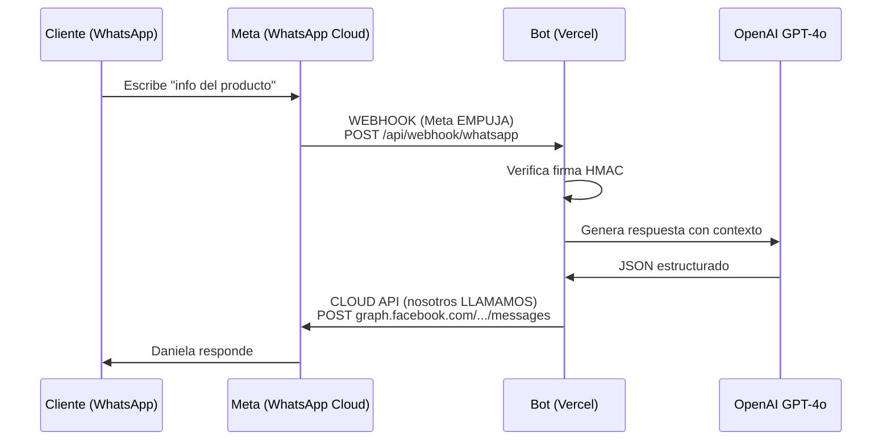

# Daniela — Arquitectura, Configuración y Replicación

Guía técnica del bot SDR de WhatsApp. Cubre cómo está construido, qué usa por fuera, cómo se conecta Meta, y **cómo clonarlo para otro producto**. Documento vivo — última actualización: 31 agosto 2026.

> **Este repo es una plantilla.** Está corriendo en producción para Grupo Terranova (rubro inmobiliario), pero el pipeline, el panel, el aprendizaje y el ruteo son agnósticos del producto. La sección 13 lista exactamente qué cambiar para un negocio distinto.

---

## 1. Qué es

Daniela es una **SDR (vendedora) autónoma que atiende WhatsApp**. Recibe mensajes, responde con contexto real del catálogo, califica al lead, agenda citas, escala al humano correcto y da seguimiento. Corre 24/7, con un panel CRM para que el equipo tome el control cuando quiera.

No es un árbol de botones: cada respuesta la genera un modelo de IA con el conocimiento del negocio inyectado en tiempo real.

---

## 2. Stack tecnológico

| Capa | Tecnología | Versión | Rol |
|------|-----------|---------|-----|
| Framework | **Next.js** (App Router) | 16.2.6 | API routes (webhook, crons) + panel web en un solo repo |
| Runtime | **React** | 19.2.4 | UI del panel |
| Hosting | **Vercel** | — | Serverless functions + cron jobs + deploy por git push |
| Base de datos | **Supabase** (PostgreSQL) | SDK 2.106 | Datos, autenticación del panel, RLS |
| IA (cerebro) | **OpenAI GPT-4o** | SDK 6.39 | Genera cada respuesta en JSON estructurado |
| IA (voz) | **OpenAI Whisper** | — | Transcribe notas de voz a texto |
| Mensajería | **WhatsApp Cloud API** (Meta) | Graph v23.0 | Recibir (webhook) y enviar mensajes |
| Calendario | **Google Calendar API** | googleapis 173 | Agenda citas automáticas |
| Estilos | **Tailwind CSS** | 4 | UI |
| Lenguaje | **TypeScript** | 5 | Todo el código |
| Tests | **Vitest** | 4.1.7 | 443 tests unitarios |

> **Nota de nombres:** la carpeta `services/claude/` se llama así por legado, pero **usa OpenAI GPT-4o**, no Claude. El modelo está fijado en `services/claude/client.ts` (`MODEL = 'gpt-4o'`).

---

## 3. Servicios externos

| Servicio | Host | Para qué | Variables |
|----------|------|----------|-----------|
| **Meta WhatsApp** | `graph.facebook.com` | Recibir y enviar mensajes | `WA_ACCESS_TOKEN`, `WA_PHONE_NUMBER_ID`, `WA_APP_SECRET`, `WA_WEBHOOK_VERIFY_TOKEN` |
| **OpenAI** | `api.openai.com` | GPT-4o (respuestas) + Whisper (voz) | `OPENAI_API_KEY` |
| **Supabase** | `*.supabase.co` | Base de datos + auth del panel | `SUPABASE_URL`, `SUPABASE_SERVICE_ROLE_KEY`, `NEXT_PUBLIC_SUPABASE_URL`, `NEXT_PUBLIC_SUPABASE_ANON_KEY` |
| **API de catálogo** | *(propio del negocio)* | Inventario en vivo | `GT_API_URL`, `GT_API_SECRET` |
| **Google Calendar** | `googleapis.com` | Crear eventos de citas | `GOOGLE_SERVICE_ACCOUNT_EMAIL`, `GOOGLE_SERVICE_ACCOUNT_PRIVATE_KEY`, `GOOGLE_CALENDAR_ID` |

**El catálogo NO está hardcodeado.** Daniela consulta el API del negocio (con caché de 1 hora), así que publicar un producto nuevo en el sitio = Daniela ya lo sabe, sin deploy. Al clonar, este es el adaptador que se reemplaza (ver sección 13).

---

## 4. Cómo se conecta Meta: webhook para ENTRAR, Cloud API para SALIR


```mermaid
sequenceDiagram
    participant C as Cliente (WhatsApp)
    participant M as Meta (WhatsApp Cloud)
    participant B as Bot (Vercel)
    participant AI as OpenAI GPT-4o

    C->>M: Escribe "info del producto"
    M->>B: WEBHOOK (Meta EMPUJA)<br/>POST /api/webhook/whatsapp
    B->>B: Verifica firma HMAC
    B->>AI: Genera respuesta con contexto
    AI->>B: JSON estructurado
    B->>M: CLOUD API (nosotros LLAMAMOS)<br/>POST graph.facebook.com/.../messages
    M->>C: Daniela responde
```

**📥 Entrada — WEBHOOK.** WhatsApp **no tiene endpoint para consultar mensajes**. El único mecanismo de recepción es el webhook: registras una URL y Meta te avisa al instante. Cada webhook viene firmado (HMAC-SHA256) y se verifica con `WA_APP_SECRET` antes de procesar (`services/whatsapp/webhook.ts`).

**📤 Salida — CLOUD API.** Para responder llamamos a `POST graph.facebook.com/v23.0/{PHONE_NUMBER_ID}/messages`. Vive en `services/whatsapp/client.ts`.

> **Webhook = oreja. Cloud API = boca.** Ambos apuntan al mismo número, definido por `WA_PHONE_NUMBER_ID`.

---

## 5. El pipeline del webhook, paso a paso

Todo ocurre en `app/api/webhook/whatsapp/route.ts`:

1. **Verifica firma HMAC** — rechaza POSTs no firmados por Meta.
2. **Parsea el lote** — Meta puede agrupar varios mensajes.
3. **Deduplica + carga el equipo** (en paralelo) — ignora mensajes ya procesados.
4. **🛡️ Cortocircuito de números internos** — si escribe el CEO o un asesor, se marca leído, se registra en `activity_log` y **se corta**. Sin lead, sin GPT, sin respuesta. *(ver sección 6)*
5. **Transcribe voz / describe imagen** — Whisper convierte notas de voz.
6. **Upsert del lead** — crea o actualiza.
7. **Pausa global** — si `agent_enabled = false`, guarda el mensaje y no responde a nadie.
8. **Chequea takeover humano** — si `bot_active = false`, Daniela se calla.
9. **Debounce adaptativo** — espera 2-10s a que el cliente termine su ráfaga.
10. **Re-chequea takeover** — un humano pudo tomar el chat durante el debounce.
11. **Arma el contexto** (en paralelo): catálogo + playbook + cerebro + reglas de escalación + memoria del deal + fuente del lead + objetivos.
12. **Llama a GPT-4o** — con reintento si devuelve JSON inválido.
13. **Ejecuta acciones** — agenda cita, escala al humano correcto, crea secuencia, envía media, guarda aprendizajes.
14. **Responde** — con fallback: si GPT o WhatsApp fallan, el cliente nunca queda en visto.

---

## 6. 🛡️ Números internos y ruteo de alertas

Sistema que evita que el equipo sea tratado como cliente, y que dirige cada alerta a la persona correcta. Vive en `lib/team-routing.ts`.

### Quién es "interno"

| Origen | Dónde se configura |
|--------|--------------------|
| CEO | variable `CEO_PHONE_NUMBER` |
| Asesores | columna `wa_phone` en `team_members` (editable desde Panel → Configuración → Equipo) |

Si un número interno le escribe al bot: **visto azul, cero respuesta**, y queda registrado como `internal_message_ignored` en `activity_log`. No se crea lead ni se gasta GPT/Whisper.

> **Fail-safe deliberado:** si no se puede leer `team_members`, solo se protege al CEO. Marcar por error a un cliente real como interno lo dejaría sin respuesta (venta perdida); el error inverso solo expone a un asesor a un mensaje de venta.

### A quién le llega cada alerta

| Acción del modelo | Destinatario |
|-------------------|--------------|
| `escalate_ceo` (dinero, documentos legales, reuniones) | **Siempre el CEO** |
| `consult_team` (consultas, apoyo) | El asesor asignado al lead; si no hay, cae al CEO |

### ⚠️ Formato del teléfono — el error que cuesta encontrar

La Cloud API espera `"to": "50362087916"` — **solo dígitos**. Con `+` o espacios, **Meta responde 200 pero no entrega el mensaje**. El fallo es invisible: el log dice "Alerta enviada", `activity_log` registra el escalamiento, no hay ningún error… y nadie recibe nada.

Por eso `sendInternalNotification` limpia el destino a solo-dígitos antes de enviar. **Si clonas el repo, no quites esa limpieza.**

---

## 7. Base de datos (Supabase / PostgreSQL)

Se crea corriendo, **en orden**, en el SQL Editor de Supabase:

| Archivo | Qué crea |
|---------|----------|
| `database/schema.sql` | **Base: `leads` y `conversations`** ← empieza por aquí |
| `002_knowledge_base.sql` | `knowledge_base` — playbook de ventas (pitches, objeciones, técnicas) |
| `003_panel_crm.sql` | `team_members`, `tags`, `lead_tags`, `lead_notes` + RLS |
| `004_proactive.sql` | `message_templates`, `recontact_rules`, `campaigns`, `campaign_recipients`, `known_listings` + columnas `leads.opted_out` y `leads.last_proactive_at` |
| `005_sdr_agent.sql` | `deal_summaries` (memoria), `sequences`, `agent_brain` (cerebro), `agent_metrics` |
| `006_escalation_rules.sql` | `escalation_rules` — reglas de escalación configurables |
| `007_project_scripts_media.sql` | `project_scripts` (guiones) + `project_media` (material a enviar) |
| `008_media_source.sql` | Columnas `source`/`project_slug` en `project_media` |
| `009_agent_settings.sql` | `agent_settings` — perillas de comportamiento vivas |
| `010_rls_hardening.sql` | RLS en `knowledge_base` y `escalation_rules` |
| `011_repair_and_observability.sql` | `lead_sources`, `ad_campaigns`, `activity_log`, `cron_runs` |
| `012_total_panel_config.sql` | `prompt_blocks` (personalidad editable), `agent_objectives`, +14 perillas incl. `agent_enabled` (pausa global) |
| `013_hard_close_triggers.sql` | Disparadores de traspaso (dinero, documentos legales) + retira el número de cuenta bancaria del playbook |

Todas las tablas tienen **RLS**. El panel usa la llave `anon` con políticas; el bot usa `service_role` (solo servidor, nunca en el browser).

### 🔍 Auditoría de esquema — córrela SIEMPRE después de migrar

Las migraciones se corren a mano, y **una que se aplica a medias no avisa**: el código degrada en silencio. Esta consulta detecta columnas faltantes:

```sql
SELECT c.tabla || '.' || c.columna AS campo,
       EXISTS (SELECT 1 FROM information_schema.columns
               WHERE table_schema = 'public' AND table_name = c.tabla AND column_name = c.columna) AS existe
FROM (VALUES
  ('leads','opted_out'), ('leads','last_proactive_at'), ('leads','assigned_to'),
  ('leads','bot_active'), ('team_members','wa_phone'),
  ('agent_brain','seen_count'), ('agent_brain','last_seen_at'),
  ('project_media','source'), ('project_media','project_slug')
) AS c(tabla, columna)
ORDER BY existe, campo;
```

**Todo debe salir `true`.** Cada `false` es una función rota sin síntoma visible.

---

## 8. Trabajos programados (Cron jobs de Vercel)

Definidos en `vercel.json`. Los horarios están en **UTC**; El Salvador es UTC-6.

| Ruta | UTC | Hora local | Qué hace |
|------|-----|-----------|----------|
| `/api/cron/sequences` | `30 15 * * *` | 9:30 AM | Envía seguimientos programados (plantilla HSM fuera de la ventana de 24h) |
| `/api/cron/daily` | `0 16 * * *` | 10:00 AM | Radar de productos nuevos + reglas de recontacto + sync de media + **reflexión nocturna (aprendizaje)** |
| `/api/cron/weekly` | `0 14 * * 1` | Lunes 8:00 AM | Reporte semanal al CEO |

### Restricciones del plan Hobby (verificadas)

- **Ventana flexible de 1 hora** — Vercel dispara *dentro* de la hora programada, no al minuto exacto. Para seguimientos comerciales es irrelevante.
- **Cadencia diaria** — no uses expresiones sub-diarias (`0 */2 * * *`) en Hobby.
- Los 3 crons de este repo están registrados y habilitados sin problema.

> **Para acelerar el aprendizaje** (opcional, al escalar): subir a Vercel Pro y bajar la cadencia, **o** usar un pinger externo gratuito ([cron-job.org](https://cron-job.org)) que llame a cada endpoint con `Authorization: Bearer $CRON_SECRET`. El pinger vive fuera de Vercel, así que la restricción no aplica.

---

## 9. ⚠️ Fallos silenciosos — la lista que ahorra días

Este sistema degrada en vez de crashear. Es bueno para el cliente (nunca queda en visto) y **peligroso para ti**: varias funciones pueden estar muertas sin un solo error visible. Todas estas ocurrieron de verdad:

| Síntoma | Causa | Cómo detectarlo |
|---------|-------|-----------------|
| **Los crons nunca corren** | Falta `CRON_SECRET`. El endpoint devuelve **401** y Vercel no lo reporta como fallo | `SELECT * FROM cron_runs ORDER BY started_at DESC;` → vacío |
| **Los seguimientos no salen** | Falta `WA_TEMPLATE_FOLLOWUP`. Fuera de la ventana de 24h, el envío queda **bloqueado** | `GET /api/health` → `important: ["WA_TEMPLATE_FOLLOWUP"]` |
| **Las alertas no llegan** | Teléfono con `+` o espacios. Meta responde **200** y no entrega | Log dice "Alerta enviada" pero nadie recibe nada |
| **El opt-out no se guarda** | Falta la columna `leads.opted_out`. `updateLead` lanza excepción | Auditoría de esquema (sección 7) |
| **Mensajes repetidos al cliente** | Falta `leads.last_proactive_at`. Se envía, luego truena al registrar, y reenvía en la siguiente corrida | Auditoría de esquema (sección 7) |
| **El equipo recibe venta** | `team_members.wa_phone` vacío. Solo el CEO queda protegido | `SELECT name, wa_phone FROM team_members WHERE active;` |

**Regla:** después de cualquier despliegue o migración, corre `GET /api/health` y la auditoría de esquema. `status: "healthy"` con `critical: []` e `important: []` es la única señal confiable.

---

## 10. Variables de entorno

Ninguna se guarda en git (`.gitignore` excluye `.env*`). En Vercel: Settings → Environment Variables, marcando **Production + Preview**.

Clasificadas por criticidad según `lib/env-check.ts`:

### 🔴 Críticas — sin ellas el bot no responde

| Variable | De dónde sale |
|----------|---------------|
| `WA_ACCESS_TOKEN` | Meta → System user token permanente |
| `WA_PHONE_NUMBER_ID` | Meta → API Setup (define **qué número usa el bot**) |
| `WA_APP_SECRET` | Meta → App Settings → Basic |
| `WA_WEBHOOK_VERIFY_TOKEN` | Lo inventas tú (string aleatorio) |
| `OPENAI_API_KEY` | platform.openai.com |
| `SUPABASE_URL` | Supabase → Settings → API |
| `SUPABASE_SERVICE_ROLE_KEY` | Supabase → Settings → API (solo servidor) |

### 🟡 Importantes — funciones que mueren en silencio si faltan

| Variable | De dónde sale | Qué se rompe si falta |
|----------|---------------|----------------------|
| `CRON_SECRET` | Lo inventas tú (`openssl rand -hex 32`) | **Los 3 crons dan 401 y nunca corren** |
| `CEO_PHONE_NUMBER` | Número del CEO | No llegan alertas ni reportes |
| `WA_TEMPLATE_CEO_ALERT` | Nombre de la plantilla HSM (`alerta_lead_hot`) | La alerta se pierde fuera de la ventana de 24h |
| `WA_TEMPLATE_FOLLOWUP` | Nombre de la plantilla HSM (`seguimiento_interes`) | **Los seguimientos quedan bloqueados** |
| `GT_API_URL` / `GT_API_SECRET` | Backend del catálogo del negocio | Daniela no conoce el inventario |

### 🟢 Integraciones opcionales

| Variable | Qué habilita |
|----------|--------------|
| `GOOGLE_SERVICE_ACCOUNT_EMAIL` / `..._PRIVATE_KEY` / `GOOGLE_CALENDAR_ID` | Crear eventos de calendario al agendar |
| `NEXT_PUBLIC_SUPABASE_URL` / `NEXT_PUBLIC_SUPABASE_ANON_KEY` | Panel web (browser) |
| `NEXT_PUBLIC_SITE_URL` | URL de producción (invitaciones del equipo) |
| `WA_DEBOUNCE_MS` | Override del debounce (los tests usan 0) |

---

## 11. Plantillas HSM de Meta

WhatsApp **rechaza texto libre si el destinatario no escribió en las últimas 24 horas**. Las plantillas aprobadas son la única forma de reactivar. Este repo usa dos:

| Plantilla | Categoría | Variables | Uso |
|-----------|-----------|-----------|-----|
| `alerta_lead_hot` | Utility | `{{1}}` nombre · `{{2}}` teléfono · `{{3}}` motivo | Alerta al humano cuando Daniela escala |
| `seguimiento_interes` | Marketing | `{{1}}` nombre · `{{2}}` tema | Seguimiento fuera de la ventana de 24h |

**El orden de las variables importa** — el código las manda posicionalmente (`services/whatsapp/client.ts`, `app/api/cron/sequences/route.ts`). Si creas plantillas nuevas, respeta el orden o ajusta el código.

> Las plantillas viven **por WhatsApp Business Account (WABA)**, no por app. Si tienes varios números en WABAs distintas, **hay que crear la plantilla en cada una**.

### Números de prueba de Meta

Mientras uses el número de prueba que regala Meta:

- Solo puede **enviar** a números pre-registrados (máximo 5). Se agregan en `developers.facebook.com` → tu app → **WhatsApp → API Setup** → campo **"To"** → *Manage phone number list*, con verificación por código.
- **Incluye el número del CEO en esa lista**, o las alertas no llegan.
- Recibir no tiene restricción: cualquiera puede escribirle.
- Al migrar al número oficial, la restricción **desaparece sola**.

---

## 12. Verificación post-despliegue

```bash
curl -s https://<tu-dominio>/api/health
```

Esperado: `"status": "healthy"` con `critical: []` e `important: []`.
(`degraded` con solo las de Google significa que el calendario no está conectado — el resto funciona.)

Luego, en Supabase:

```sql
-- ¿Corrieron los crons?
SELECT job, status, started_at, result FROM cron_runs ORDER BY started_at DESC LIMIT 5;

-- ¿Se está protegiendo al equipo?
SELECT action, details, created_at FROM activity_log
WHERE action = 'internal_message_ignored' ORDER BY created_at DESC LIMIT 5;

-- ¿Daniela responde? (respuestas debe ser > 0)
SELECT l.phone, l.stage,
       (SELECT count(*) FROM conversations c WHERE c.lead_id = l.id AND c.role = 'assistant') AS respuestas
FROM leads l ORDER BY l.last_message_at DESC NULLS LAST LIMIT 10;
```

Y las pruebas manuales:

1. **Cliente normal** → visto azul + "escribiendo…" + respuesta coherente.
2. **Nota de voz** → transcribe y responde.
3. **Número interno** (el CEO) → visto azul y **silencio**.
4. **Frase de escalamiento** ("quiero hablar con el CEO", "cuál es la cuenta bancaria") → **le llega la alerta al humano**.

---

## 13. 📦 Clonar el bot a otro producto

### Lo que se configura SIN tocar código

Prefiere siempre estos caminos: sobreviven a los `git pull` del repo plantilla.

| Qué | Dónde |
|-----|-------|
| Personalidad, tono, estilo de escritura | Panel → Personalidad (tabla `prompt_blocks`) |
| Emojis, trato tú/usted, instrucciones libres, pausa global | Panel → Ajustes (tabla `agent_settings`) |
| Conocimiento del negocio | Panel → Conocimiento (tabla `agent_brain`) |
| Playbook de ventas, objeciones, FAQ | tabla `knowledge_base` |
| Cuándo escalar y a quién | Panel → Escalamiento (tabla `escalation_rules`) |
| Guiones por producto | Panel → Guiones (tabla `project_scripts`) |
| Material a enviar (PDF, imágenes, video) | tabla `project_media` |
| Objetivos del negocio | tabla `agent_objectives` |
| Umbrales de escalamiento (presupuesto, unidades) | `agent_settings`: `escalation_budget_usd`, `escalation_units` |
| Nombre del CEO en las frases de escalación | `agent_settings`: `ceo_name` |
| Equipo y sus teléfonos | Panel → Configuración → Equipo |

### Lo que EXIGE editar código

1. **Adaptador de catálogo** — reemplazar `services/projects/gt-api.ts` por el del inventario nuevo. Debe respetar la misma interfaz (`getAllProjects()` → lista con `name`/`price`/`description`) y los sinónimos de detección del rubro (`SYNONYMS`).
2. **Identidad base del agente** — nombre de la agente y de la empresa en `services/claude/prompts.ts` y en los defaults de `lib/prompt-blocks.ts`.
3. **Vocabulario del rubro** — los bloques de prompt asumen inmobiliaria (plusvalía, prima, escrituración). Para otro rubro hay que reescribirlos.
4. **Locale** — zona horaria `America/El_Salvador`, moneda USD y código de idioma `es` están asumidos en varios puntos.

### Checklist de puesta en marcha

**Fase A — Meta**
1. App nueva en `developers.facebook.com` → Business → producto WhatsApp.
2. Obtener `WA_PHONE_NUMBER_ID`, `WA_ACCESS_TOKEN` (system user, permanente), `WA_APP_SECRET`.
3. Inventar `WA_WEBHOOK_VERIFY_TOKEN`.
4. Webhook: URL `https://<dominio>/api/webhook/whatsapp`, suscrito al evento `messages`.
5. Crear las 2 plantillas HSM **en la WABA del número que se va a usar** (sección 11).
6. Si es número de prueba: agregar los destinatarios permitidos, **incluido el del CEO**.

**Fase B — Supabase**
1. Proyecto nuevo → copiar las 4 llaves.
2. Correr `database/schema.sql` y **después** las migraciones `002` → `013` en orden.
3. **Correr la auditoría de esquema** (sección 7) → todo `true`.
4. Crear el primer admin en Auth + fila en `team_members`.

**Fase C — Vercel**
1. Importar el repo de GitHub.
2. Cargar TODAS las variables de la sección 10 (Production + Preview).
3. `git push` a `main` → deploy automático.

**Fase D — Contenido**
1. Sembrar `knowledge_base`, `agent_brain`, `project_scripts`, `escalation_rules`.
2. Ajustar `prompt_blocks` y `agent_settings` desde el panel.
3. Cargar el equipo con sus `wa_phone`.

**Fase E — Verificar**
1. `GET /api/health` → `healthy`.
2. Las 4 pruebas manuales de la sección 12.

---

## 14. 🧩 Mapa modular — qué tocar cuando el sistema crezca

| Quiero… | Archivo(s) |
|---------|-----------|
| Cambiar el carácter base de la agente | `services/claude/prompts.ts` |
| Ajustar comportamiento sin deploy | tabla `agent_settings` |
| Cambiar quién recibe cada alerta | `lib/team-routing.ts` |
| El flujo del mensaje (orquestación) | `app/api/webhook/whatsapp/route.ts` |
| Canal WhatsApp (envíos, plantillas) | `services/whatsapp/client.ts` |
| Catálogo de productos | `services/projects/gt-api.ts` |
| Aprendizaje automático | `lib/reflection.ts` |
| Tiempos (debounce, tipeo) | `lib/debounce.ts` + `calculateTypingDelay` |
| El modelo de IA y sus parámetros | `services/claude/client.ts` (`MODEL`, `MAX_TOKENS`) |
| Scoring de leads | `lib/lead-scoring.ts` |
| Métricas del dashboard | `lib/analytics.ts` |

**Regla de crecimiento:** contenido y comportamiento → base de datos (sin deploy). Estructura y canal → código. Si un ajuste se repite seguido, se convierte en una perilla de `agent_settings`.

---

## 15. Decisiones clave y por qué

- **IA generativa en vez de árbol de botones** → los clientes no siguen el guion.
- **Catálogo por API** → el equipo publica y el bot lo sabe sin deploy.
- **Cortocircuito de números internos** → el equipo no es cliente, y no se gasta GPT en ellos.
- **Teléfonos normalizados a solo-dígitos** → un `+` hacía que Meta aceptara el envío y no entregara nada.
- **Fail-safe hacia el cliente** → ante la duda, tratar como cliente; nunca dejar a alguien sin respuesta.
- **Debounce adaptativo** → la gente manda 3 mensajitos; se espera y se responde una vez.
- **Plantillas HSM** → única forma de escribir fuera de la ventana de 24h.
- **Campañas con aprobación humana** → los crons **crean** campañas en `pending_approval`; nada masivo sale sin que un humano lo apruebe.

---

## 16. Documentos relacionados

- `GUIA-MAESTRA-BOT-SDR.md` — checklist de lanzamiento + bitácora de problemas resueltos.
- `MANUAL-META-OPERACION.md` — operación de Meta (plantillas, números).
- `GUIA-PLANTILLAS-META.md` — detalle de plantillas HSM.
- `AUDITORIA-ENTERPRISE-2026-06.md` — auditoría técnica.
