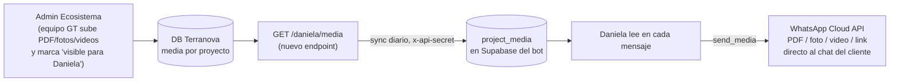

# Brief: conectar el Ecosistema Terranova con Daniela (PDF, imágenes, videos)

**Objetivo:** centralizar TODO el material de proyectos (brochures PDF, imágenes, videos, ubicaciones) en el Ecosistema Terranova (`api.grupoterranovasv.com`), y que Daniela lo envíe sola en el chat del cliente — sin intervención humana, sin duplicar contenido.

> Este documento supersede a `INTEGRACION-MEDIA-ECOSISTEMA.md` (aquel era el borrador). Aquí está el contrato exacto verificado contra el código del bot + el prompt listo para el agente de Terranova.

---

## Parte 0 — La foto completa (cómo va a fluir)



**Reparto de trabajo:**
- **Ecosistema Terranova (lo que tu agente construye):** guardar el material + un endpoint que lo exponga. *Partes 1–4.*
- **Bot Daniela (YA ESTÁ LISTO):** sincroniza ese endpoint cada día y envía. *Parte 5. No tocas nada del bot.*

---

## Parte 1 — Qué espera Daniela HOY (contrato real, verificado en código)

Daniela ya envía material. Hoy lo lee de una tabla `project_media` en su propia base (Supabase). Cada fila:

| Campo | Tipo | Significado |
|-------|------|-------------|
| `project_key` | text | Fragmento en minúsculas que **aparece en el nombre del proyecto**. Ej: `portacelli` matchea "Portacelli Alta - Fase 1". Así se decide a qué proyecto pertenece el material. |
| `media_type` | enum | `brochure` · `image` · `video` · `link` · `price_list` · `floor_plan` |
| `url` | text | **URL pública HTTPS**. WhatsApp la descarga del lado del servidor. |
| `caption` | text? | Pie de foto / descripción opcional |
| `sort_order` | int | Orden de envío (menor primero) |

**Cómo Daniela pide el envío** (lo decide el modelo, guiado por el guion del proyecto): un objeto `send_media { type, project }` donde `type` ∈ `document | image | video | link`. El bot resuelve:

| `type` que pide Daniela | Qué envía |
|-------------------------|-----------|
| `document` | El primer `brochure` / `price_list` / `floor_plan` del proyecto → como **PDF adjunto** |
| `image` | Hasta **3** `image` del proyecto → fotos en ráfaga |
| `video` | El primer `video` → video en el chat |
| `link` | El primer `link` → mensaje de texto con el caption + la URL (ej: ubicación de Google Earth) |

**Límites de WhatsApp (obligatorios, o el envío falla):**
- URL **pública** (un `curl <url>` debe bajar el archivo, sin login ni token)
- **HTTPS** obligatorio
- PDF: `application/pdf`, ≤ **100 MB**
- Imagen: JPG/PNG, ≤ **5 MB**
- Video: MP4 (H.264 + AAC), ≤ **16 MB**

---

## Parte 2 — La decisión de centralizar (y el punto de privacidad crítico)

Centralizar en Terranova es lo correcto: **una sola fuente de verdad**. El equipo sube el material una vez en el admin que ya usan, y Daniela lo tiene automáticamente. Hoy el material se carga a mano en la base del bot — eso queda como respaldo, pero lo nuevo vive en Terranova.

🔒 **PUNTO CRÍTICO DE PRIVACIDAD.** El Ecosistema ya tiene un apartado que muestra contenido **solo a clientes registrados** de un proyecto (avances de obra privados, documentos de su unidad, etc.). **Daniela le escribe a PROSPECTOS, no a clientes.** Por lo tanto:

> El material que Daniela puede enviar es un **subconjunto explícitamente marcado como "público / apto para prospectos"**. NUNCA el contenido exclusivo de clientes registrados.

Esto se resuelve con un flag `daniela_visible` (o `visibility = 'prospect'`) en cada pieza de media. El endpoint que consume el bot **solo devuelve lo marcado visible para Daniela**. Un humano decide, pieza por pieza, qué es apto para mostrarle a un desconocido. Sin ese flag, jamás sale.

---

## Parte 3 — Modelo de datos en el Ecosistema

Probablemente ya tienes una entidad de media asociada a proyectos (la del portal de clientes). Extiéndela, o crea una tabla dedicada para lo público. Campos mínimos:

| Campo | Tipo | Notas |
|-------|------|-------|
| `id` | uuid/pk | |
| `project_id` / `listing_id` | fk | El proyecto/listing al que pertenece |
| `project_slug` | text | El mismo `slug` que ya devuelves en `GET /listings` (identificador canónico) |
| `project_key` | text | Fragmento en minúsculas presente en el nombre del listing (ej: `portacelli`). Para material compartido de la familia usa la palabra ancla; para algo específico de una unidad usa un fragmento más preciso. |
| `media_type` | enum | `brochure \| image \| video \| link \| price_list \| floor_plan` |
| `url` | text | URL pública HTTPS del archivo en tu storage/CDN |
| `caption` | text? | Descripción |
| `sort_order` | int | Orden de envío |
| **`daniela_visible`** | bool | **El candado de privacidad.** true = Daniela puede enviarlo a prospectos. Default **false**. |
| `active` | bool | Encendido/apagado |

**Storage:** los archivos deben quedar en un bucket/CDN público (o tu dominio `grupoterranovasv.com/media/...`). Al subir, valida los límites de WhatsApp (Parte 1) y rechaza lo que exceda.

---

## Parte 4 — El endpoint que construye el Ecosistema

Un solo endpoint nuevo, con las mismas convenciones que tu API actual (`GET /listings` + header `x-api-secret`):

```
GET  {BASE}/daniela/media
Header:  x-api-secret: <el mismo GT_API_SECRET que ya usa /listings>
```

**Debe devolver SOLO** filas con `daniela_visible = true` AND `active = true`. Respuesta:

```jsonc
{
  "media": [
    {
      "project_key": "portacelli",                 // requerido, minúsculas, aparece en el nombre del listing
      "project_slug": "portacelli-alta",           // opcional pero recomendado (trazabilidad)
      "media_type": "brochure",                    // brochure|image|video|link|price_list|floor_plan
      "url": "https://grupoterranovasv.com/media/portacelli/brochure.pdf",  // pública https
      "caption": "Brochure oficial de Portacelli",
      "sort_order": 1
    },
    {
      "project_key": "portacelli",
      "media_type": "link",
      "url": "https://earth.google.com/earth/d/1b3wkUV2ZZK8P6zy4FY3SMnz85QiKGPMh?usp=sharing",
      "caption": "Ubicación exacta de Portacelli 🌍",
      "sort_order": 1
    },
    {
      "project_key": "portacelli",
      "media_type": "image",
      "url": "https://grupoterranovasv.com/media/portacelli/avance-julio.jpg",
      "caption": "Avance de obra — julio 2026",
      "sort_order": 2
    }
  ]
}
```

También se acepta el array pelado (`[ {...}, {...} ]`) sin el envoltorio `media`. El bot tolera ambos.

**Reglas del endpoint:**
1. Solo `daniela_visible = true` y `active = true`. **Nunca** contenido de clientes.
2. `url` siempre HTTPS pública.
3. `project_key` en minúsculas, y que realmente aparezca en el nombre del listing correspondiente (así el bot lo asocia al proyecto correcto).
4. Respuesta rápida (< 2s) — el bot la llama en un cron, pero mejor ágil.
5. Auth con el header `x-api-secret` existente. Si falta o es inválido → 401.

---

## Parte 5 — Lo que YA está listo en el bot (no tocas nada aquí)

El bot ya trae todo lo necesario para consumir ese endpoint — se activa solo cuando el endpoint exista:

- **Sync diario** (`lib/media-sync.ts`, ya en el cron `/api/cron/daily`): llama `GET {GT_API_URL}{GT_MEDIA_PATH}` (default `/daniela/media`) con `x-api-secret`, valida (https, tipos, límites) y vuelca a `project_media`.
- **Aislamiento**: el sync administra solo las filas con `source = 'ecosystem'`; lo cargado a mano/panel (`source = 'manual'`) no se toca. (Migración `008_media_source.sql`.)
- **Fallback-safe**: mientras el endpoint no exista (404), el sync hace no-op silencioso. Nada se rompe.
- **Override opcional**: si nombras el endpoint distinto, se configura con la variable `GT_MEDIA_PATH` en Vercel (ej: `/api/marketing-media`). Sin tocar código.

Cuando el endpoint esté vivo: **subes un PDF en tu admin → al siguiente cron Daniela ya lo envía.** Cero pasos manuales. (Si quieres inmediatez en vez de "al siguiente cron", ver Parte 7.)

---

## Parte 6 — 🤖 PROMPT PARA EL AGENTE DEL ECOSISTEMA TERRANOVA

> Copia y pega esto tal cual en el agente/repositorio del backend de Grupo Terranova (`api.grupoterranovasv.com`). Ajusta los nombres de tablas/framework a los tuyos.

```
CONTEXTO
Somos Grupo Terranova. Nuestro bot de ventas de WhatsApp, "Daniela", necesita
enviar material de nuestros proyectos (brochures PDF, imágenes, videos y links
de ubicación) directamente en el chat de los prospectos, sin intervención
humana. Este backend (api.grupoterranovasv.com) ya expone GET /listings con
header x-api-secret y ya administra media de proyectos para el portal de
clientes registrados. Debemos exponer un subconjunto PÚBLICO de ese material
a Daniela mediante un nuevo endpoint.

TAREA
1. MODELO DE DATOS: en la entidad de media de proyectos (o una nueva tabla si
   la actual es solo para el portal de clientes), asegúrate de tener:
   - project_slug (el mismo slug que devuelve /listings)
   - project_key (text, minúsculas: un fragmento que aparezca en el nombre del
     listing, ej. "portacelli")
   - media_type (enum: brochure, image, video, link, price_list, floor_plan)
   - url (text: URL PÚBLICA HTTPS del archivo en storage/CDN)
   - caption (text, opcional)
   - sort_order (int, default 0)
   - daniela_visible (boolean, default FALSE)  ← candado de privacidad
   - active (boolean, default true)

2. ADMIN UI: en la ficha de cada proyecto/listing, permite subir/gestionar
   estos medios y un checkbox "Visible para Daniela (prospectos)". Ese checkbox
   controla daniela_visible. Al subir archivos, VALIDA los límites de WhatsApp
   y rechaza lo que exceda:
   - PDF application/pdf ≤ 100 MB
   - imagen JPG/PNG ≤ 5 MB
   - video MP4 (H.264 + AAC) ≤ 16 MB
   Los archivos deben quedar en un bucket/CDN PÚBLICO (sin auth, sin URL firmada
   con expiración).

3. ENDPOINT: crea  GET /daniela/media
   - Auth: header x-api-secret (mismo secreto que /listings). Sin él → 401.
   - Devuelve SOLO filas con daniela_visible = true AND active = true.
   - NUNCA devuelvas contenido exclusivo de clientes registrados.
   - Formato de respuesta EXACTO:
     {
       "media": [
         { "project_key": "portacelli", "project_slug": "portacelli-alta",
           "media_type": "brochure",
           "url": "https://.../brochure.pdf",
           "caption": "Brochure oficial", "sort_order": 1 }
       ]
     }
   - project_key en minúsculas; media_type uno de los 6 valores; url https.

REGLAS DE SEGURIDAD (innegociables)
- daniela_visible=false por defecto: nada sale a prospectos hasta que un humano
  lo marque explícitamente.
- El endpoint jamás debe filtrar media del portal de clientes ni datos de
  clientes. Solo el subconjunto marcado visible para Daniela.

CRITERIOS DE ACEPTACIÓN (pruebas)
- GET /daniela/media sin x-api-secret → 401.
- GET /daniela/media con secret válido → 200 y solo medios daniela_visible=true.
- Un medio con daniela_visible=false NO aparece en la respuesta.
- Todas las url devueltas responden 200 con un curl anónimo (públicas).
- Subir un PDF de 150MB o un video de 30MB es rechazado con error claro.
- El formato de cada item coincide exactamente con el contrato de arriba.
```

---

## Parte 7 — Activación end-to-end (checklist)

1. **Bot (ya hecho):** correr en Supabase la migración `008_media_source.sql` (agrega `source`/`project_slug` a `project_media`). *Pendiente de correr — igual que la 007.*
2. **Ecosistema:** implementar Partes 3–4 con el prompt de la Parte 6.
3. **Marcar material:** en el admin, subir el brochure de Portacelli + fotos de avances y marcarlos "Visible para Daniela".
4. **Verificar el endpoint:** `curl -H "x-api-secret: <secreto>" https://api.grupoterranovasv.com/daniela/media` → debe listar el material público.
5. **(Opcional) Configurar `GT_MEDIA_PATH`** en Vercel si el endpoint tiene otro nombre.
6. **Esperar el cron** (diario 10am SV) o dispararlo: el bot sincroniza a `project_media`.
7. **Probar:** escribirle "info de portacelli" a Daniela → llega al paso del brochure → envía el PDF real.

**¿Quieres inmediatez en vez de "al siguiente cron"?** El admin del Ecosistema hace un `POST {BOT_URL}/api/cron/daily` con `Authorization: Bearer <CRON_SECRET>` cuando se guarda media visible → el sync corre al instante. (O agregamos un endpoint dedicado `/api/sync-media` en el bot; 15 min de trabajo cuando lo necesites.)
